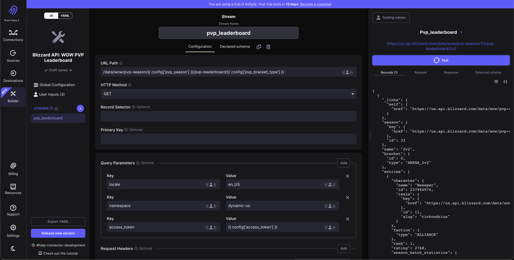
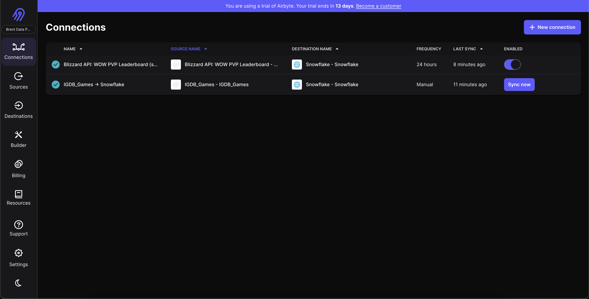
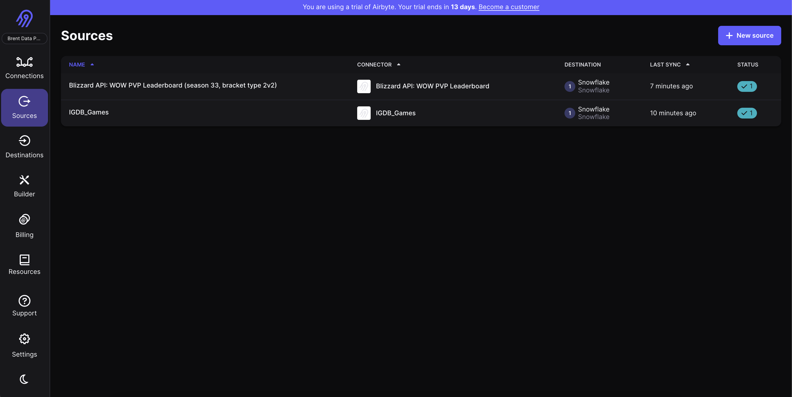
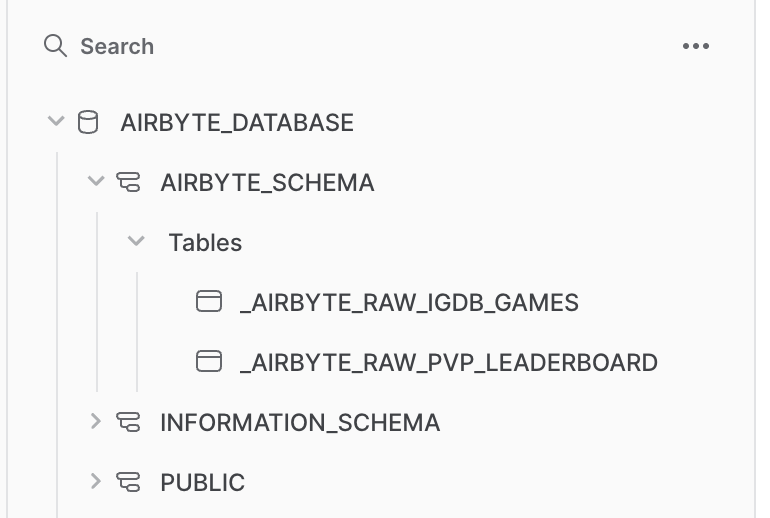
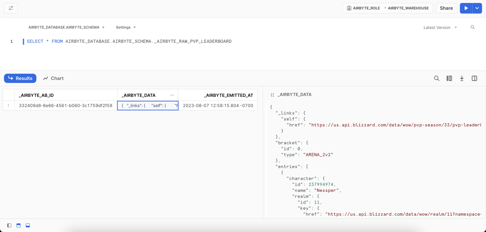
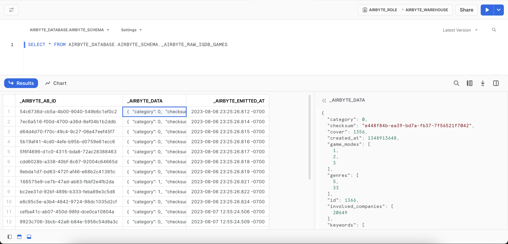

# Extract & Load

## Airbyte --> Snowflake

I'm using [Airbyte](https://airbyte.com) to orchestrate replicating data from API's into Snowflake.  Airbyte is a tool that lets you set up connections between sources and destinations - so you might have one source flowing into multiple destinations, and commonly many sources flowing into the same destination

Here's a link to a demo app, to see it in the wild: https://demo.airbyte.io/workspaces/55c39a0b-037d-406c-a1ac-00393b055f18/connections

Here's some screenshots showing the current setup for this project:

